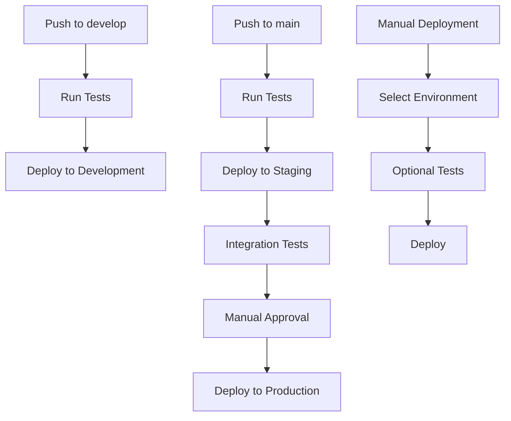

# GitHub Actions CI/CD Pipeline Setup

This repository uses GitHub Actions for automated testing, building, and deployment of the Order Receiver serverless application.

## 🚀 Overview

The CI/CD pipeline includes:
- **Automated Testing**: Backend (Python) and Frontend (Flutter) tests
- **Multi-Environment Deployment**: Development, Staging, and Production
- **Security Scanning**: Secret detection, dependency scanning, SAST, and infrastructure security
- **Performance Testing**: Load testing and frontend performance analysis
- **Infrastructure as Code**: Terraform provisioning workflows

## 📋 Workflows

### 1. Main CI/CD Pipeline (`ci-cd.yml`)
- **Triggers**: Push to `main` or `develop` branches, PRs to `main`
- **Jobs**:
  - `test-backend`: Runs Python tests with coverage
  - `test-frontend`: Runs Flutter tests and analysis
  - `build-and-deploy-dev`: Deploys to development on `develop` branch
  - `build-and-deploy-staging`: Deploys to staging on `main` branch
  - `deploy-production`: Deploys to production after staging validation
  - `build-flutter-web`: Builds Flutter web application
  - `deploy-flutter-web`: Deploys web app to S3/CloudFront

### 2. Manual Deployment (`manual-deployment.yml`)
- **Triggers**: Manual workflow dispatch
- **Features**:
  - Choose target environment (dev/staging/production)
  - Optional frontend deployment
  - Optional test execution
  - Flexible parameter configuration

### 3. Infrastructure Provisioning (`infrastructure.yml`)
- **Triggers**: Manual workflow dispatch
- **Actions**: Terraform plan, apply, or destroy
- **Environments**: dev, staging, production

### 4. Security Scanning (`security.yml`)
- **Triggers**: Push, PR, weekly schedule
- **Scans**:
  - Secret detection with TruffleHog
  - Dependency vulnerabilities (Python, Node.js, Flutter)
  - Static code analysis with CodeQL
  - Infrastructure security with Checkov
  - Container vulnerability scanning with Trivy

### 5. Performance Testing (`performance.yml`)
- **Triggers**: Manual workflow dispatch
- **Tests**:
  - Load testing with Locust
  - Frontend performance with Lighthouse

## 🔧 Setup Instructions

### 1. GitHub Environments

Create three environments in your repository settings:
- `development`
- `staging` 
- `production`

### 2. Required Secrets

#### AWS Credentials
```
# Development & Staging
AWS_ACCESS_KEY_ID
AWS_SECRET_ACCESS_KEY

# Production (separate account recommended)
AWS_ACCESS_KEY_ID_PROD
AWS_SECRET_ACCESS_KEY_PROD
```

#### Deployment Configuration
```
# S3 Buckets for SAM deployments
SAM_DEPLOYMENT_BUCKET_DEV
SAM_DEPLOYMENT_BUCKET_STAGING
SAM_DEPLOYMENT_BUCKET_PROD

# Application secrets per environment
SECRET_KEY_DEV
SECRET_KEY_STAGING
SECRET_KEY_PROD

# CORS origins per environment
CORS_ORIGINS_DEV=http://localhost:3000,http://localhost:8080
CORS_ORIGINS_STAGING=https://staging.yourdomain.com
CORS_ORIGINS_PROD=https://yourdomain.com

# Frontend deployment (production)
WEB_S3_BUCKET=your-web-bucket-name
CLOUDFRONT_DISTRIBUTION_ID=your-cloudfront-id

# Terraform state
TERRAFORM_STATE_BUCKET=your-terraform-state-bucket
```

### 3. Pre-requisites

#### AWS Resources
Create these resources manually or via Terraform:

1. **S3 Buckets**:
   - SAM deployment buckets (one per environment)
   - Terraform state bucket
   - Web hosting bucket (for Flutter app)

2. **IAM Roles/Users**:
   - GitHub Actions service user with appropriate permissions
   - Separate credentials for production (recommended)

3. **CloudFront Distribution** (for web app):
   - Origin pointing to S3 web bucket
   - Custom domain setup (optional)

#### Local Development
```bash
# Install required tools
pip install aws-sam-cli
npm install -g @aws-cdk/cli
curl -fsSL https://apt.releases.hashicorp.com/gpg | sudo apt-key add -
sudo apt-add-repository "deb [arch=amd64] https://apt.releases.hashicorp.com $(lsb_release -cs) main"
sudo apt-get update && sudo apt-get install terraform

# Configure AWS CLI
aws configure

# Install Flutter
# Follow official Flutter installation guide
```

### 4. Environment Configuration

#### Development
- Auto-deploys on push to `develop` branch
- Minimal security constraints
- Suitable for feature testing

#### Staging
- Auto-deploys on push to `main` branch
- Production-like environment
- Full test suite execution
- Manual approval (optional)

#### Production
- Deploys after successful staging deployment
- Manual approval required
- Enhanced monitoring and rollback capabilities
- Separate AWS account recommended

## 🔄 Deployment Flow



## 🧪 Testing Strategy

### Backend Tests
- Unit tests with pytest
- Integration tests against deployed APIs
- Coverage reporting with Codecov

### Frontend Tests
- Flutter widget tests
- Integration tests
- Code analysis with flutter analyze

### Security Tests
- Secret scanning
- Dependency vulnerability checks
- Static code analysis
- Infrastructure security scanning

### Performance Tests
- API load testing with configurable parameters
- Frontend performance with Lighthouse
- Automated performance budgets

## 📊 Monitoring and Alerts

### CloudWatch Integration
- Lambda function metrics
- API Gateway performance
- DynamoDB operations
- Custom application metrics

### GitHub Actions Notifications
- Slack integration (configure webhook)
- Email notifications on failures
- Status badges for README

## 🔧 Troubleshooting

### Common Issues

1. **Deployment Failures**
   - Check AWS credentials and permissions
   - Verify S3 bucket accessibility
   - Review CloudFormation stack events

2. **Test Failures**
   - Check test environment setup
   - Verify API endpoints accessibility
   - Review test data and dependencies

3. **Security Scan Failures**
   - Address identified vulnerabilities
   - Update dependencies
   - Review and rotate secrets

### Debug Commands
```bash
# Check SAM deployment locally
cd infrastructure
sam build --use-container
sam local start-api

# Validate Terraform configuration
terraform fmt -check
terraform validate
terraform plan

# Test Flutter build
cd frontend
flutter pub get
flutter analyze
flutter test
flutter build web
```

## 📈 Optimization Tips

1. **Caching**
   - Use GitHub Actions cache for dependencies
   - Cache SAM builds between deployments
   - Cache Terraform providers and modules

2. **Parallel Execution**
   - Run independent tests in parallel
   - Use matrix strategies for multi-environment tests
   - Optimize job dependencies

3. **Resource Management**
   - Use appropriate runner sizes
   - Clean up temporary resources
   - Optimize Docker layer caching

## 🔄 Rollback Procedures

### Automated Rollback
- CloudFormation stack rollback on deployment failure
- Blue-green deployment for zero-downtime updates

### Manual Rollback
```bash
# Rollback to previous version
aws cloudformation cancel-update-stack --stack-name order-receiver-production

# Deploy specific version
git checkout <previous-commit>
# Trigger manual deployment workflow
```

## 📚 Additional Resources

- [AWS SAM Documentation](https://docs.aws.amazon.com/serverless-application-model/)
- [GitHub Actions Documentation](https://docs.github.com/en/actions)
- [Terraform AWS Provider](https://registry.terraform.io/providers/hashicorp/aws/latest/docs)
- [Flutter CI/CD Best Practices](https://docs.flutter.dev/deployment/cd)

## 🤝 Contributing

1. Create feature branch from `develop`
2. Implement changes with tests
3. Create PR to `develop` for development deployment
4. After testing, create PR to `main` for staging/production deployment

## 📞 Support

- Check workflow run logs in GitHub Actions tab
- Review CloudFormation events in AWS Console
- Monitor application logs in CloudWatch
- Contact DevOps team for infrastructure issues
